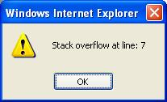
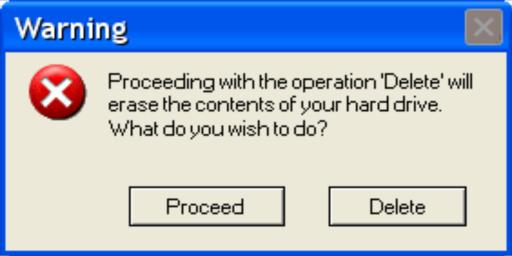

% R Error Handling
% Thomas Wutzler
% Jena, BGI code group 2012

## Motivation 

Annoyed by errors such as



Principles

1. Fail early  
	Notice the error as soon as possible.
2. Fail gracefully  
	Allow handling of the error.


## Crude way: stop on error 
```{r}
fDivide <- function(a,b){
	if ( !is.numeric(b) ) stop("argument b must be numeric") 
	if ( b==0 ) stop("argument b must be non-zero")
	a/b
}
c <- fDivide(5,0)    
```

* Advantages: Fail early
	+ notice the error as soon as possible
	+ otherwise the return value INF might cause error far downstream
* Disadvantages: stopped ungraceful
	- We want to handle the error instead of directly throwing error messages at the user
	- We may want to clear up: close connections, delete temporary files, free memory ... 

## Confusing way: mixing error and return values
```{r}
fDivide <- function(a,b){
	errMsg <- if(!is.numeric(b)){ "argument b must be numeric" 
		}else if (b==0){ "argument b must be non-zero"
		}else character(0)
	list( result=a/b, errMsg=errMsg )
}
res <- fDivide(5,0)
if( length(res$errMsg) ){
  # clean up
  # traceback()	# prints the call stack
  stop(paste("An unexpected error occured. Please contact the administrator."
  	," Details:",res$errMsg) )
}else{
  c <- res$result
}  
```

* Advantages: stopped gracefully
* Disadvantages: Code gets really confusing. How to separate return form error signaling?

## try statement
Automatic conversion of an error (that is generated by stop) into a return value.
 
```{r}
fDivide <- function(a,b){
	if ( b==0 ) stop("argument b must be non-zero")
	a/b
}

c <- try( fDivide(5,0), silent=TRUE )
if( inherits(c,"try-error")){   
  stop(paste("An unexpected error occured. Please contact the administrator."
  	," Details:",res$errMsg) )
}  
```

First stop in fDivide ensures "Fail early"

Try combined with second stop ensures "Fail gracefully"

## tryCatch statement
```{r}
tryCatch({
   c <- fDivide(5,0)
   cat("This code is not executed because the error by division is trapped\n") 
}
,error=function(e){
	stop(paste("An unexpected error occured. Please contact the administrator."
		," Details:",e$message) )   
}
,finally={ cat("do some cleanup (e.g. setwd)\n") }
)
```

* Code is now quite clear

* on error the value of the function to the `error` argument is returned
	* Error is called from the level of the code-block of tryCatch
	* Hence it know variables defined in this code block before the error 

* Finally provides expression that is executed both on success and on error 

## Summary

* Principles
	1. Fail early
	2. Fail gracefully
	
* R support
	- ?try
	- ?tryCatch
	
## Thank you	

.
 


